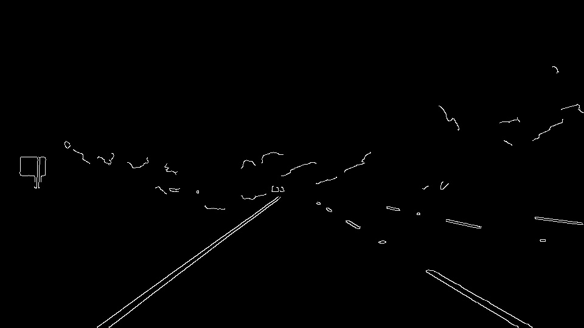
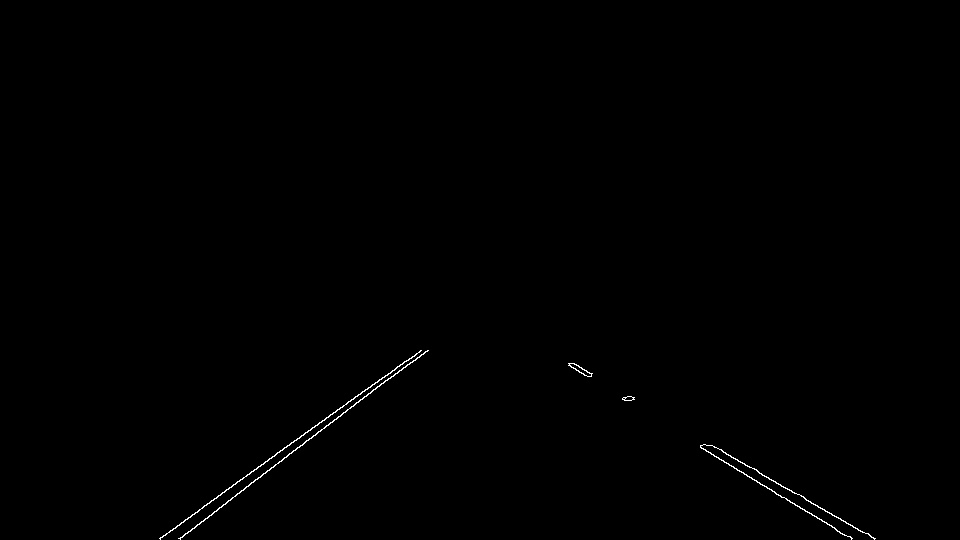
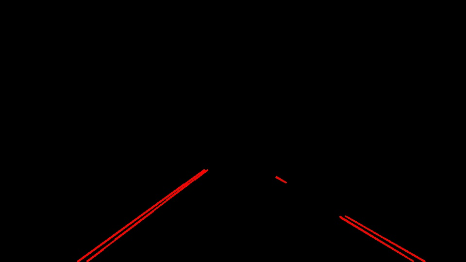
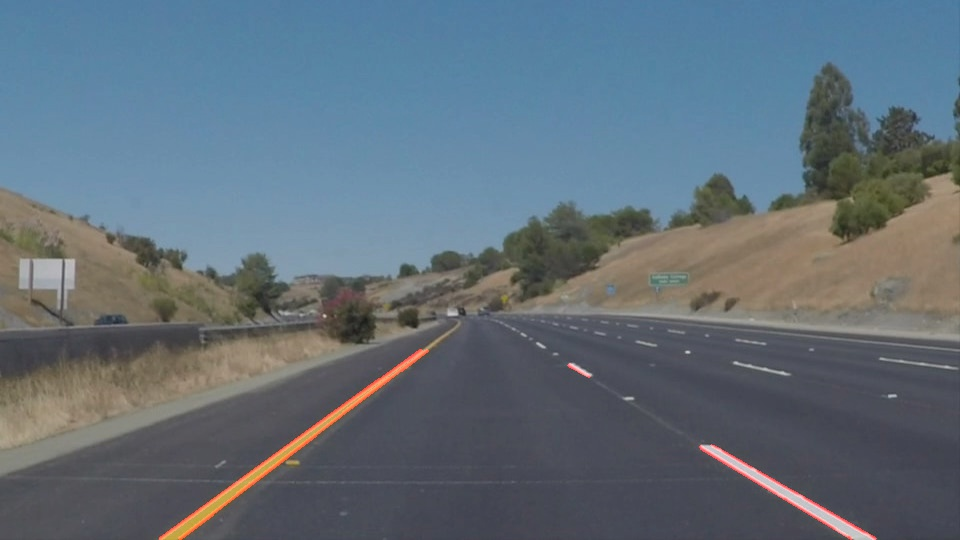
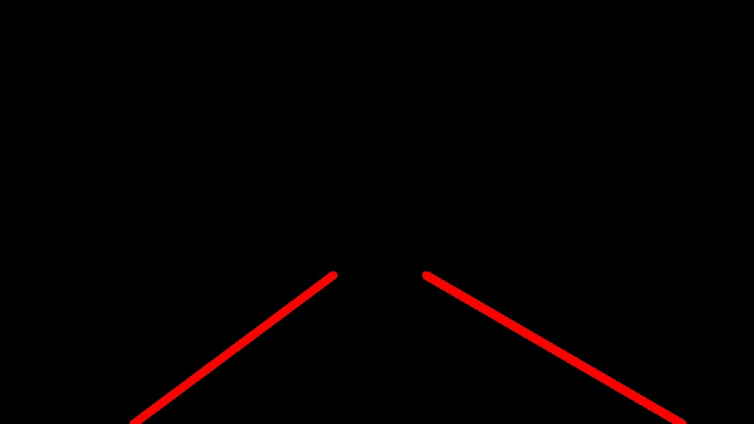

# **Finding Lane Lines on the Road** 

Overview
---

This project is an amalgamation of Python, OpenCV and my growing love for CV ;)

Pipeline used for lane line detection :
* Input Image
* Converting to Grayscale 
* Gaussian Blur
* Canny edge detection
* ROI selection
* Hough Lines detection

Installations
---

1. Install Anaconda on your local setup (Choose Python 3 version - [Link](https://www.anaconda.com/distribution/))
2. Create an environment (More on environments [here](https://conda.io/projects/conda/en/latest/user-guide/tasks/manage-environments.html))
Open cmd and type - `> conda create --name myenv` This will create an environment with default python version, which is Python 3 for this project.
3. Activate the environment, using `> activate myenv`
4. Install Libraries :
OpenCV : `> conda install -c conda-forge opencv `
moviepy (used in this project to work with videos): `> pip install moviepy`

Each stage result 
---
#### Input Image

#### Grayscaled Image

#### Gaussian Blurred Image

#### Canny Edge Detection 

#### ROI Selection

#### Hough Lines

### Final Output

Extrapolatoin of line segments
---
* All the line segments are divided into **_left_lane_lines_** and **_right_lane_Lines_** using slopes of the lines
* A line is fitted to both sets resulting in one line for each side

#### Improved Hough Lines

### Improved Final Output

HSV Color Space
---
When working with images and color selection HSV color space becomes quite handy (Learn more about HSV and HSL color space [here]()).

Using **H**ue **S**aturation **V**alue color space and [`cv2.inRange()`](https://www.learnopencv.com/color-spaces-in-opencv-cpp-python/) function we can select any color range from image.
This technique is used for final challenge video.
