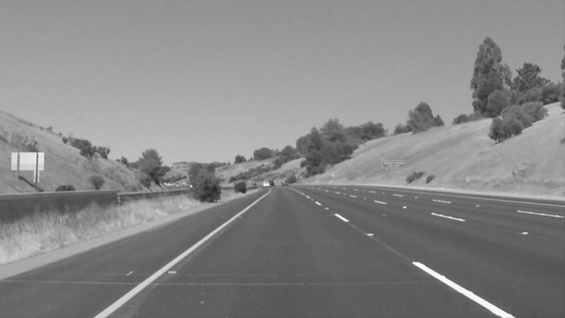

# **Finding Lane Lines on the Road** 

Pipeline
---

Basic Pipeline used for lane line detection consists of 5 steps:

* Converting to Grayscale 
* Gaussian Blur
* Canny edge detection
* ROI selection
* Hough Lines detection

**Step 1:** The input image was converted to grayscale to work with only one channel
**Step 2:** Then Gaussian filter of kernel size 5x5 was applied to filter out low frequency noise
**Step 3:** On the smoothened image canny edge detector was applied with low_threshold = 120 and high_threshold = 240
**Step 4:** Now only region of interest was cropped out using `cv2.fillPoly()` 
**Step 5:** for line detection I used already written hough_line function with parameters:
        rho = 1
        theta = np.pi/180
        threshold = 10
        min_line_length = 20
        max_line_gap = 10
        
I created one more helper function called `display_img(image)` which was used to display images read by opencv the reason I had do this is because opencv reads image in BGR format where as matplotlib uses RGB format. so make dispalying of image streamlined I ctreated this function.

Each stage result 
---
#### Input Image

#### Grayscaled Image

#### Gaussian Blurred Image

#### Canny Edge Detection 

#### ROI Selection

#### Hough Lines

### Final Output

Extrapolatoin of line segments
---

## Improvements to draw_lines() function

#### Steps taken to improve draw_lines() function

1. I kept two lists for each side of lanes
    `right_lane_lines` and `left_lane_lines`

2. Calculated slopes of each line with `slope = (y2 - y2) / (x2 -x1)`

3. if the slope is less than 0.4 discard the line because it is too flat to be lane line and if the slope is negative append that line to `right_lane_lines` or to `left_lane_lines` 

4. make a list of x and y coordinates from both list, this will be used for fitting the line, this was done using `chain()` function from `itertools`

5. After getting x and y coordinates for both side we fit a line using `cv2.polyfit()`, this will give slope and intercept for the fitted line

6. Now we have slope and intercept of both lanes and we need to extrapolate these line to entire ROI. we know the coordinates of ROI but we can only use y coordinates 

7. So now we have y coordinates of lines and need to get x, we cant directly use `cv2.poly1d()` function because it gives y given x so I created a function `calc_x(coeff, y)`

        def calc_x(coeff, y):
            return((y - coeff[1]) / coeff[0])
            
this function returns x given y and slope and intercept of the line 

8. finally after getting x, y for both line lines were drawn on the image.

*Care is taken to discard lines with infinite slope and code does not break when hough lines returns no lines. *

#### Improved Hough Lines

### Improved Final Output

For the final challange HSV Color Space was used
---
When working with images and color selection HSV color space becomes quite handy (Learn more about HSV and HSL color space [here]()).

Using **H**ue **S**aturation **V**alue color space and [`cv2.inRange()`](https://www.learnopencv.com/color-spaces-in-opencv-cpp-python/) function we can select any color range from image.
This technique is used for final challenge video.

### Potential shortcomings with my current pipeline

1. One of major shortcoming of this pipeline is the bright lights. If image is highly illuminated then it wont be able to detect lines.

2. Another one can be the curved lane lines, if the lane gets suddenly curly then lane line bounces around.

### Possible improvements to my pipeline

1. Illumination issue can be dealt with by maintaining a history of lines and averaging current detected lines with previous line so that even if we cannot detect any line in the current frame we will have previous frame's line for reasonably good estimate of line

2. we can use morphological operators for more robust edge detection like `Erosion`, `Dilatoin`, `Opening`, `Closing`

